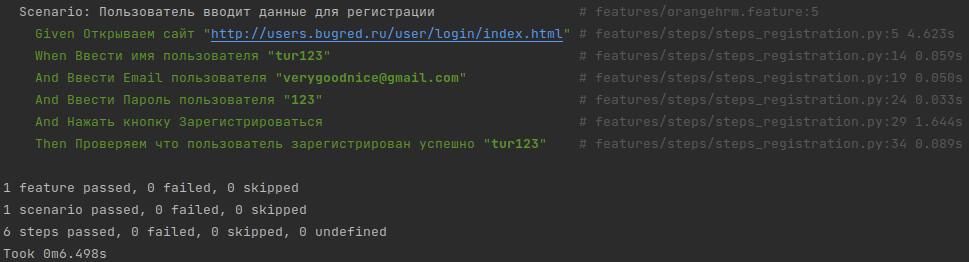

# PythonBehave

## Описание

Цель проекта: получение навыков в написание автоматизированных тестов (BDD) на Python 
на примере веб-сайта (<a href="http://users.bugred.ru/">users</a>).

## Запуск тестов

Для запуска тестов нужно ввести следующую команду 
behave

## Технологии

- Python 3.11
- Behave

## Пример запуска тестов

